# FxSR
# Flexible Image Super-Resolution Using Conditional Objective

Seung Ho Park, Young Soo Moon, and Nam Ik Cho

## Environments
- Pytorch 1.10.0
- CUDA 11.5 & cuDNN 11.4
- Python 3.8

## Abstract

Recent studies have significantly enhanced the performance of single-image super-resolution (SR) using convolutional neural networks (CNNs). While there can be many high-resolution (HR) solutions for a given input, most existing CNN-based methods do not explore alternative solutions during the inference. A typical approach to obtaining alternative SR results is to train multiple SR models with different loss weightings and exploit the combination of these models. Instead of using multiple models, we present a more efficient method to train a single adjustable SR model on various combinations of losses by taking advantage of multi-task learning. Specifically, we optimize an SR model with a conditional objective during training, where the objective is a weighted sum of multiple perceptual losses at different feature levels. The weights vary according to given conditions, and the set of weights is defined as a style controller. Also, we present an architecture appropriate for this training scheme, which is the Residual-in-Residual Dense Block equipped with spatial feature transformation layers. At the inference phase, our trained model can generate locally different outputs conditioned on the style control map. Extensive experiments show that the proposed SR model produces various desirable reconstructions without artifacts and yields comparable quantitative performance to state-of-the-art SR methods.
  

## Related Work

### Distortion Oriented Single Image Super-Resolution

#### [RRDB (ECCV 2018)] ESRGAN: Enhanced Super-Resolution Generative Adversarial Networks <a href="https://openaccess.thecvf.com/content_ECCVW_2018/papers/11133/Wang_ESRGAN_Enhanced_Super-Resolution_Generative_Adversarial_Networks_ECCVW_2018_paper.pdf">Link</a> 

### Perception Oriented Single Image Super-Resolution

#### [SRGAN (CVPR 2017)] Photo-realistic Single Image Super-Resolution Using a Generative Adversarial Network <a href="http://openaccess.thecvf.com/content_cvpr_2017/html/Ledig_Photo-Realistic_Single_Image_CVPR_2017_paper.html">Link</a> 

#### [ESRGAN (ECCV 2018)] ESRGAN: Enhanced Super-Resolution Generative Adversarial Networks <a href="https://openaccess.thecvf.com/content_ECCVW_2018/papers/11133/Wang_ESRGAN_Enhanced_Super-Resolution_Generative_Adversarial_Networks_ECCVW_2018_paper.pdf">Link</a> 

#### [SRFlow (ECCV 2020)] Recovering Realistic Texture in Image Super-Resolution by Deep Spatial Feature Transform <a href="http://de.arxiv.org/pdf/2006.14200?gitT">Link</a>
  

## Brief Description of Our Proposed Method

### <u>TARGETED PERCEPTUAL LOSS</u>

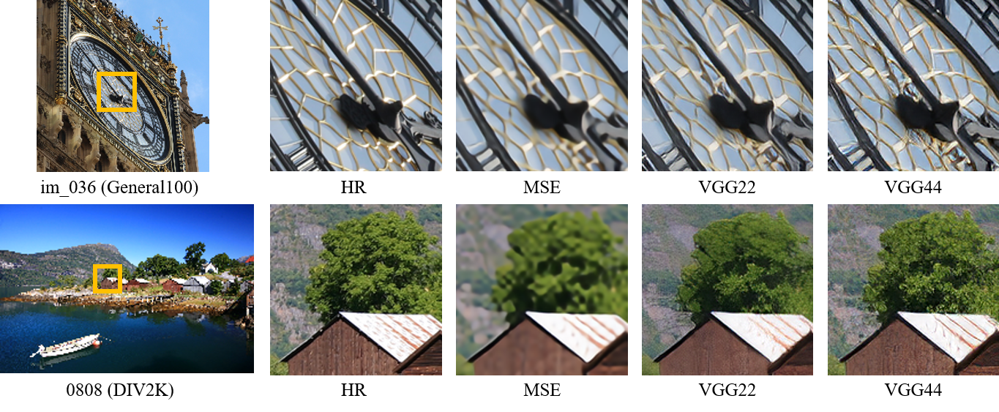

The effect of choosing different layers when estimating perceptual losses on different regions, e.g., on edge and texture regions, where the losses correspond to MSE, ReLU 2-2 (VGG22), and ReLU 4-4 (VGG44) of the VGG-19 network.

### <u>PROPOSED SR WITH FLEXIBLE STYLE</u>

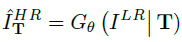

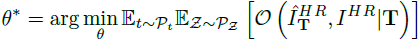

### <u>PROPOSED NETWORK ARCHITECTURE</u>

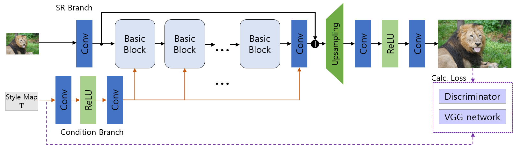

The architecture of our proposed flexible SR network. We use the RRDB equipped with SFT as a basic block. The condition branch takes a style map for reconstruction style as input. This map is used to control the recovery styles of edges and textures for each region through SFT layers.
PROPOSED SR WITH FLEXIBLE STYLE

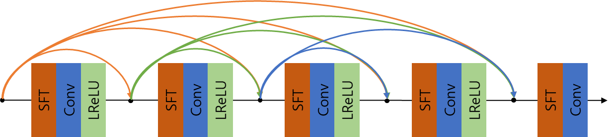

The proposed Basic Block (RRDB equipped with SFT layer)

## Experimental Results

### Evaluation of Flexible SR for Perception-Distortion (FxSR-PD)

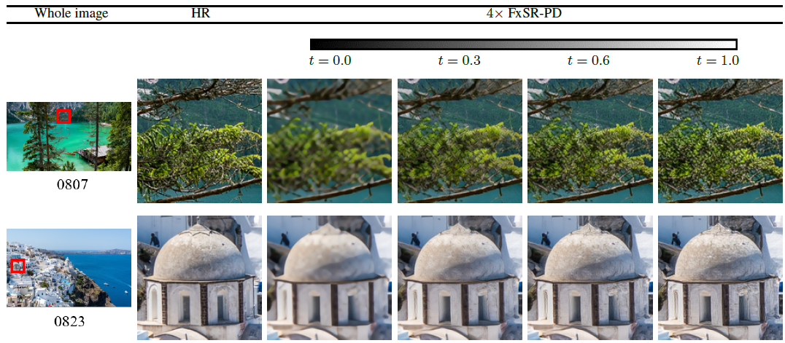

Changes in the result of FxSR-PS 4x SR according to t on DIV2K validation set.

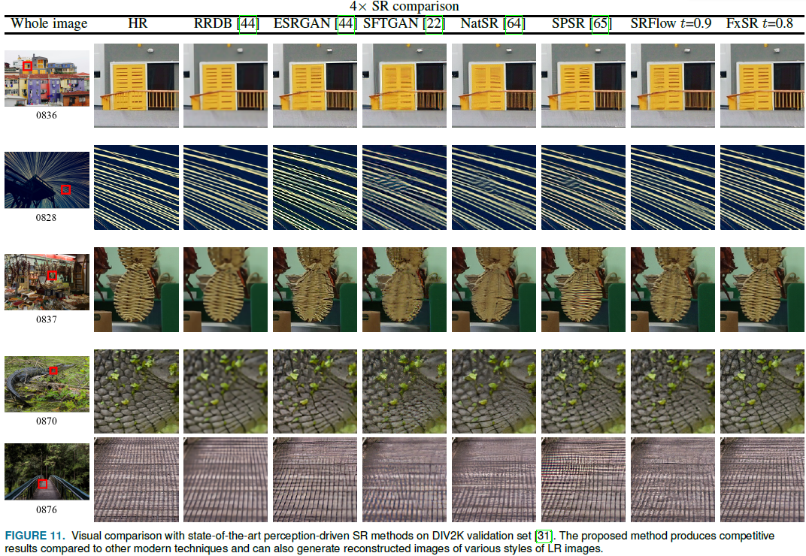

Visual comparison with state-of-the-art perception-driven SR methods on DIV2K validation set.

### Flexible SR for Diverse Styles (FxSR-DS)

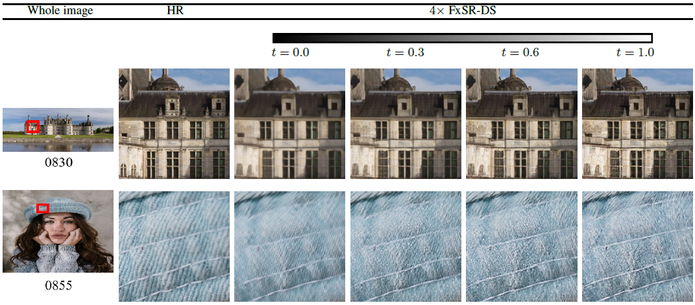

Changes in the result of FxSR-DS 4x SR according to t on DIV2K validation set.

### Per-pixel Style Control
Comparison of the SR results of the conventional method and the FxSR-DS method

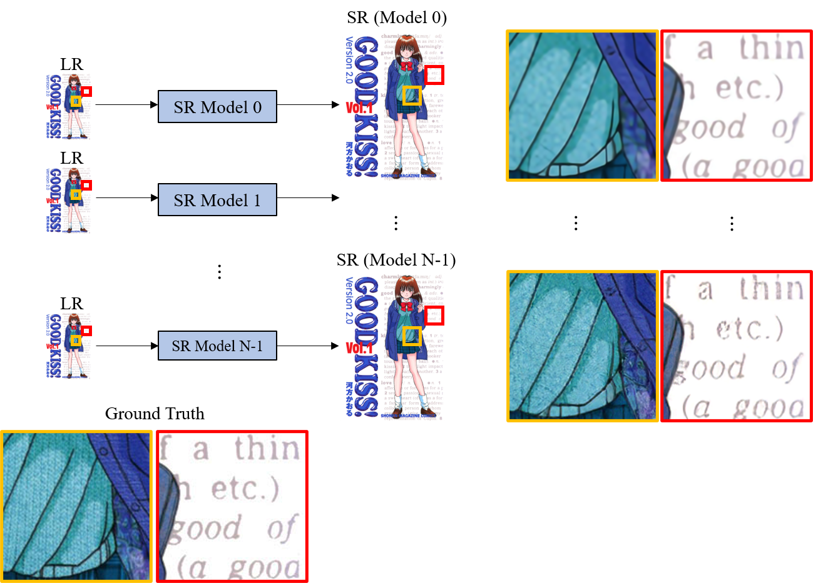

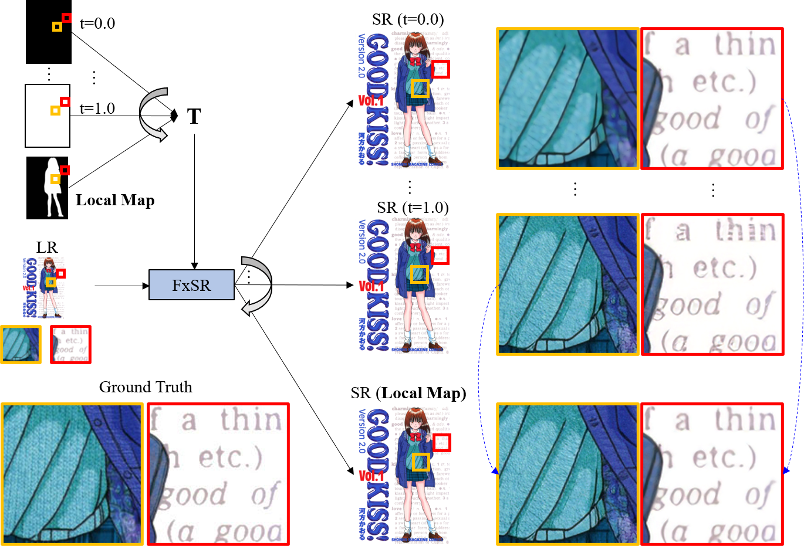

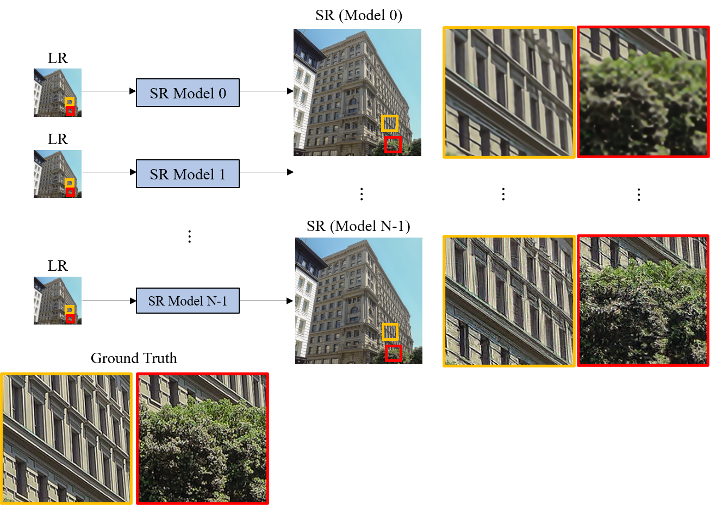

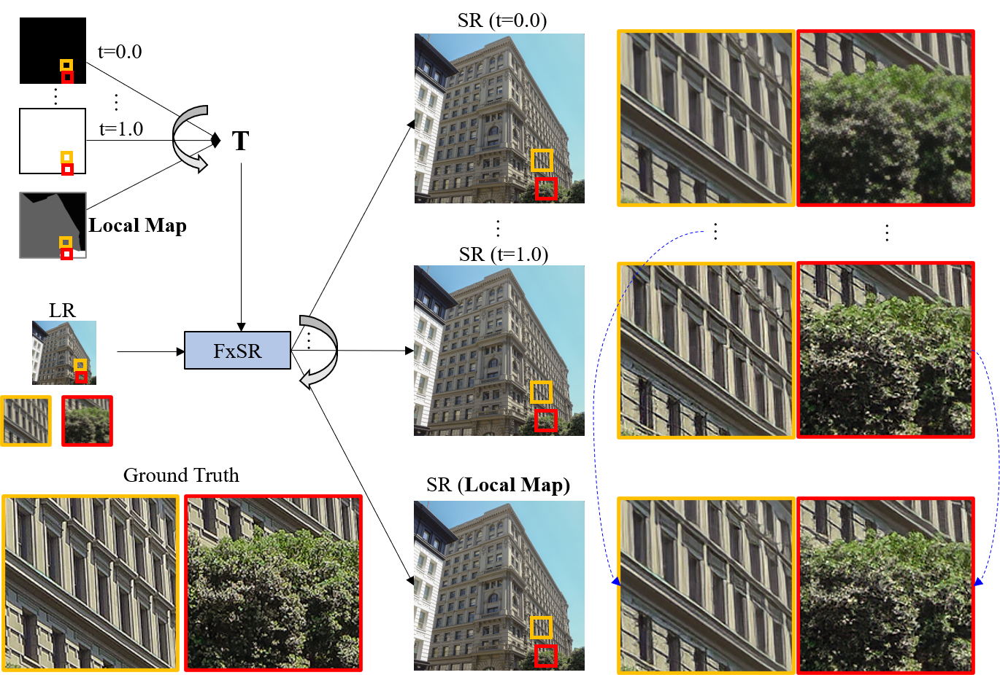

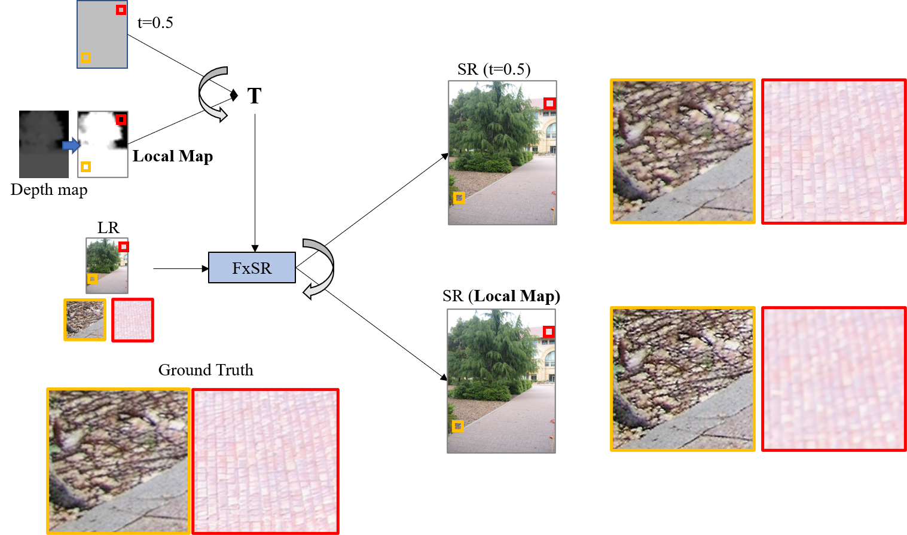

Depth-adaptive FxSR. $\mathbf{T}$-maps is the modified version of the depth map of an image from the Make3D dataset.

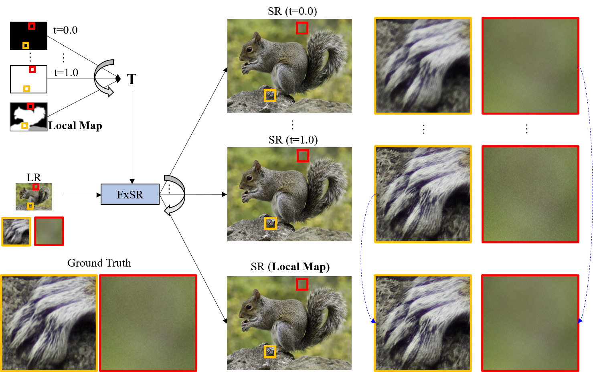

An example of applying a user-created depth map to enhance the perspective feeling with the sharper and richer textured foreground and the background with more reduced camera noise than the ground truth.

### Ablation Study

Convergence of diversity curve of the proposed FxSR-PD model as the number of training iteration increase
(a) 16 RBs with SFT, (b) using 23 RRDBs with SFT, (c) The performance comparison between two FxSR-PD version at the 250,000th iteration

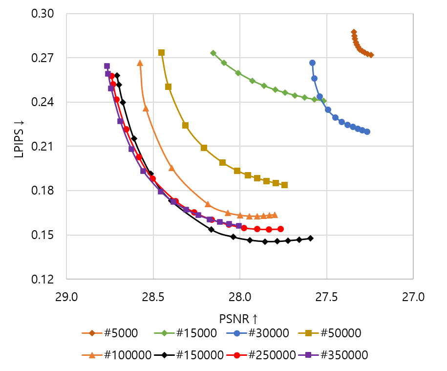

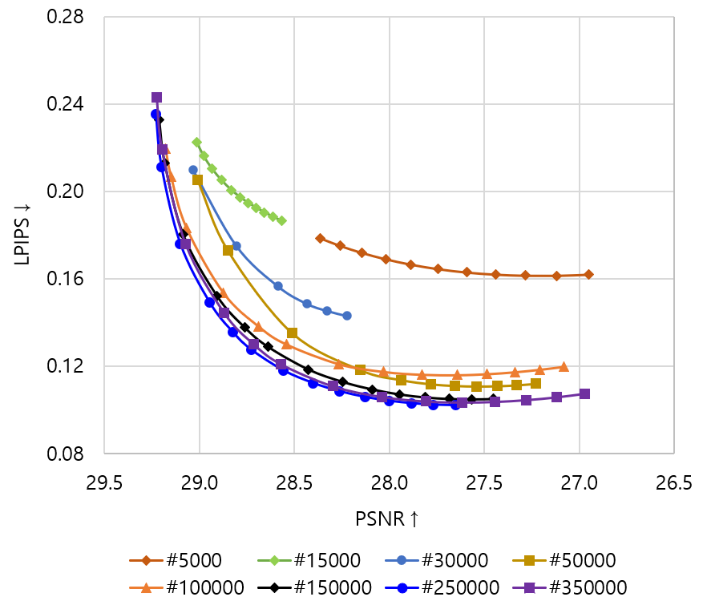

